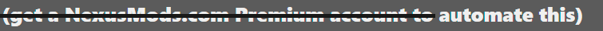
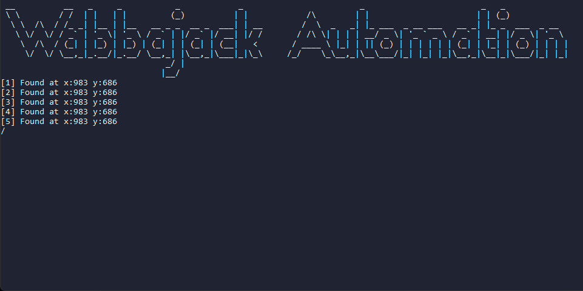

<h1 align="center">Wabbajack Automation</h1>
<div id="top"></div>
<br />
<div align="center">
    
    
</div>

<p align=center>
  <a target="_blank" href="https://www.python.org/downloads/" title="Python version"></a>
  </a>
</p>

<details>
  <summary>Table of Contents</summary>
  <ol>
    <li>
      <a href="#why">Why</a>
    </li>
    <li>
      <a href="#getting-started">Getting Started</a>
      <ul>
        <li><a href="#prerequisites">Prerequisites</a></li>
        <li><a href="#installation">Installation</a></li>
      </ul>
    </li>
    <li><a href="#usage">Usage</a></li>
    <li><a href="#contributing">Contributing</a></li>
    <li><a href="#credits">Credits</a></li>
  </ol>
</details>

## Why
> To help Nexusmod's free users to automatically download mods when using Wabbajack
<div align="center">
    
</div>

> and clicking sucks.

<p align="right">(<a href="#top">back to top</a>)</p>

## Getting Started

### Prerequisites

* [Python >= 3](https://www.python.org/downloads/)
* Imagesearch
  ```sh
  pip install python-imagesearch
  ```
* pyautogui
  ```sh
  pip install pyautogui
  ```
* pywin32
  ```sh
  pip install pywin32
  ```
### Installation

_Just clone the repository and run_

<p align="right">(<a href="#top">back to top</a>)</p>


## Usage
_You MUST leave Wabbajack's window visible, specifically, "SLOW DOWNLOAD" button._
1. Open Wabbajack and proceed to modpack download
2. Open the Wabbajack-Automation.py
3. Profit

_If the program can't find the button, consider taking a screenshot yourself._
<p align="right">(<a href="#top">back to top</a>)</p>

## Contributing

You're welcome to contribute to this mess.

<p align="right">(<a href="#top">back to top</a>)</p>

## Credits

* Martin Lees at brokencode _(https://brokencode.io/how-to-easily-image-search-with-python/)_

<p align="right">(<a href="#top">back to top</a>)</p>

